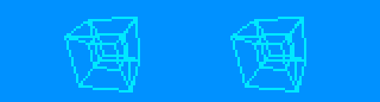
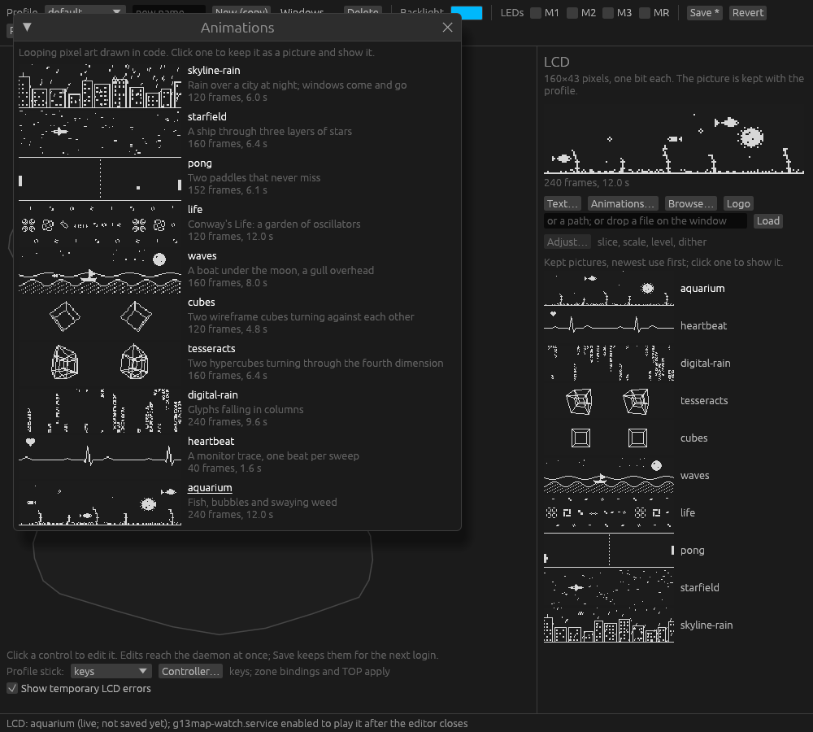

# g13pad

[](https://github.com/nyanmeister/g13pad/actions/workflows/ci.yml)

A Linux driver and configuration app for the Logitech G13 gaming keypad. You get key
bindings and profiles, the backlight colour, pictures, text and animations on the LCD, a
live health meter for games, and an optional analog stick that games see as an Xbox
controller.

Here is the editor, opened with `g13map edit`:


## What is in the box

- **`g13d`**, the driver (C++). It talks to the pad over USB and turns key presses into
  keyboard events, so games and desktops see an ordinary keyboard.
- **`g13map`**, a small command-line tool and background watcher (Rust). It applies
  profiles, feeds the LCD, switches profiles with the game in front of you and reports to a
  panel applet.
- **`g13map-editor`**, the graphical editor (Rust), launched with `g13map edit`. It is
  optional: everything it saves is a plain text file under `~/.config/g13map` that the
  CLI reads too.
- **`g13pad-analog`**, the adapter that makes the stick an Xbox-style controller.
- systemd services, udev rules and an Arch package recipe.

Builds and package staging never touch the running system. Everything works on any X11
desktop: window rules (profile switching by focused window) follow i3 and sway through
their IPC, every other X11 window manager through the EWMH root-window properties, and
Wayland compositors through the foreign-toplevel protocol (KDE and GNOME on Wayland: their
X11 clients only). Panel applets exist for LXQt, XFCE and Waybar.

## On the LCD




Two of the built-in LCD animations, shown in the panel's own two colours (sampled from a
video of the glass). The editor's **Animations…** window previews all of them live and
keeps one with a click:




The **health meter** turns the panel and the backlight into a live readout of the game in
front of you: a monitor trace that beats faster as health falls, a bar with notches at
the band edges, a hatched shield bar (solid with a helmet), and the backlight by band:
green above 75, yellow, orange, red with a flash on every beat, blue over 100 for an
overshield, and three dark seconds on a drop to zero before the search for a pulse.

A game feeds it one line at a time through a small mod or script. Feeders for Deep Rock
Galactic, Doom, Source engine games and ULTRAKILL are in `contrib/`; Counter-Strike 2
posts straight to the watcher. A profile ticks **Health mode** to show it, so the window
rules put it on the game's windows and the profile's own picture returns when the tick
comes off. `g13map health demo` runs the states on your own panel. See
[the health meter](docs/health-meter.md) and, for adding a game, [AGENTS.md](AGENTS.md).

## Install

The supported route is an OS package: it installs the services, udev rules and group
access together, and keeps your changed startup bindings and calibration across upgrades.

On Arch, export a committed source tree as `g13pad-0.2.39.tar.gz`, put it beside
`packaging/PKGBUILD`, and run `makepkg` in that directory. The recipe uses a local archive
with a placeholder checksum; a public release must supply a verified checksum. xboxdrv is
an optional separate dependency, not bundled.

After installing, read [installation and activation](docs/installation.md) for the
services to enable and the group to join, and [migration](docs/migration.md) if an
earlier patched g13 driver is already on the machine. Existing `~/.config/g13map`
profiles are kept.

## Build and check

On Arch install the build dependencies `base-devel cmake ninja rust libusb libevdev log4cpp`
and the GUI runtime dependencies listed in [the Arch recipe](packaging/PKGBUILD), including
`libglvnd libxkbcommon libxkbcommon-x11 libx11`. A first Rust build downloads the
versions pinned by Cargo.lock. For an already populated cache, add
`-DG13PAD_CARGO_OFFLINE=ON`.

```sh
./build.sh -DCMAKE_BUILD_TYPE=Release -DCMAKE_INSTALL_PREFIX=/usr -DCMAKE_INSTALL_LIBDIR=lib
./check.sh
```

The checks use mock USB and input devices and private files; no keys or pointer input
reach your desktop.

Options, for when you need them:

- `G13PAD_BUILD_DIR` and `G13PAD_JOBS` select the build directory and job count. Rust
  inherits the job count; override it with `G13PAD_RUST_JOBS` or CMake's
  `-DG13PAD_RUST_JOBS=2`. The conservative default remains two jobs.
- `-DBUILD_TESTING=OFF` omits tests.
- `-DG13PAD_BUILD_EDITOR=OFF` skips the graphical editor and its GUI dependencies, keeping
  the driver, CLI/watcher and analog helper. Also disable `G13PAD_BUILD_CLI` and
  `G13PAD_BUILD_ADAPTER` for the C++ driver only.
- In a configured full build, `cmake --build build --target g13d`, `cli`, `editor` or
  `adapter` builds just that component.
- `-DG13PAD_SANITIZER=address,undefined` with Clang enables instrumented driver checks.

The Rust workspace contains the application (`g13map`), the mapping model (`g13pad-core`)
and the adapter (`g13pad-analog`); the last two use only the standard library. For a
quick helper check:

```sh
cargo test --offline --locked -p g13pad-core -p g13pad-analog
```

See [build profiles and caches](docs/building.md) for lean development tests, full
debugger information and release/package cache reuse.

To inspect what an installation would place, stage it into a directory:

```sh
DESTDIR="$PWD/build/stage" cmake --install build
```

Then look through `build/install_manifest.txt`. Staging creates a package root; it does
not activate services. Prefer an OS package over installing onto an existing system by
hand: CMake's installation copies configuration files and does not merge them.

## Using it

### The command line

```sh
g13map --h
g13map edit                         # editor
g13map import FILE NAME             # keep an existing driver's bindings
g13map apply                        # apply the selected saved profile
g13map watch                        # profile switching and LCD playback
g13map marquee 'Message' NAME        # keep reusable LCD text, no hardware write
g13map health 87 shield 50          # feed the health meter; wait, off, demo, cs2
g13map health source DIR            # Source engine game: install the LCD module + page
g13map --version
g13map panel xfce                   # XFCE Generic Monitor status and editor button
g13map panel waybar                 # Waybar custom-module JSON
g13map panel text                   # i3blocks/Polybar/tint2 or terminal status
```

`profile` commands save files; `use` and `apply` send settings to the device. Syntax and
configuration errors go to stderr without changing the LCD. Missing hardware does not
prevent saved configuration or help/version commands. `g13map status` shows the selected
profile, connection and paths. The profile format is plain text, editable with any editor.

Two services do the background work: `g13map-apply.service` restores the saved profile at
login; `g13map-watch.service` switches profiles, plays animations, recovers from temporary
LCD errors and reapplies the profile after a driver reconnect.

### The editor

The editor offers captured keys and chords, raw daemon actions, M-key additive profile
modes, window rules, a per-profile stick preference and LCD choices.

The key picker, board and chord labels follow the active X11 keyboard layout and group,
including changes while the editor is open. Bindings keep the physical Linux `KEY_*` code,
not the letter: on a Norman layout the displayed E is `KEY_D`. The raw code is shown beside
the label, and `g13map layout` prints the current translation without a G13 attached.
Without an X display, labels use physical names; native Wayland layout tracking is not
implemented. Games may interpret keys differently, so confirm their own bindings.

Dead keys are identified explicitly. Fontconfig selects an installed fallback font for
international labels; install fonts covering the scripts you use (for example DejaVu Sans
for Hebrew). IME composition and shifted/Caps Lock text are not modeled by these
unshifted key labels.

### Profiles that follow the game

A profile can carry window rules: when a window of a matching class (`firefox`, `steam`,
the game) has focus, the watcher switches to that profile, and back when it loses focus.
Under i3 or sway the watcher listens on the IPC socket; under any other X11 window manager
it reads the focused window from the root window's EWMH properties; on Wayland it uses the
foreign-toplevel protocol where a compositor offers it, the app id standing in for the
class. The journal says which one it found (`window focus: Xfwm4 on display :0`).
`g13map focus windows` lists the windows the manager knows with their classes and marks
the focused one, so a rule can be written from a terminal; the editor's **Windows…** panel
shows the same list.

Where it works, as checked on a test machine with the pad attached (details in the
[validation record](docs/validation.md)):

| session | window rules |
|---|---|
| X11: i3, XFCE (xfwm4), KDE Plasma (KWin), MATE (Marco), Openbox, Fluxbox, IceWM, awesome, bspwm, herbstluftwm | yes, all checked |
| Wayland: sway, labwc, wayfire, river 0.3 (`river-classic`), niri | yes, all checked |
| Wayland: Hyprland | expected (it offers the protocol), not checked: it needs a GPU |
| Wayland: KDE Plasma, GNOME | X11 clients only (Steam and every Proton game among them), through their Xwayland; native windows are not followed |
| Wayland: river 0.4 | no (it is a framework that needs a window-manager client) |
| GNOME on X11 | gone upstream (Mutter 51 has no X11 mode) |

### Pictures, text and animations

Images support crop, background, threshold/dither, inversion and animation. Text supports
installed fonts, size, multiline wrapping/alignment and scrolling. **Animations…** offers
built-in looping pixel art drawn in code (a rainy skyline, a starfield, Pong, Life, waves,
cubes, digital rain, a heartbeat, an aquarium, tesseracts); a click keeps one as a picture.
`g13map-anim` lists and keeps the same scenes from a terminal.

**Show temporary LCD errors** displays errors for five seconds, then restores the latest
normal image or animation frame. The watcher performs the restoration even after the
editor closes and with automatic profile switching off. The setting is on by default.

### The health meter

The meter (0.2.17, pictured above) is fed one line at a time: `g13map health 87` (or
`87/125 shield 40/60`). `wait` is a game connected without health yet (a lobby); `off` or
an expired `ttl` gives the panel back to the profile. A profile chooses it as its picture
(`g13map profile lcd NAME health`, or `health cs2` for the watcher to run the
Counter-Strike 2 Game State listener itself). The ladder, its colours and the rest of the
look are lines in `~/.config/g13map/meter`, re-read live. See
[the health meter](docs/health-meter.md).

### The OBS overlay

`g13map obs` (0.2.39) opens a borderless, transparent window of the pad, drawn in the
style of the input-overlay plugin's pixel keyboard: keys light cyan as the pad reports
them (whatever the profile binds them to), the stick cap travels, and the LCD shows the
frame on the glass in the backlight's colour. Add it to OBS as a window capture
("G13 overlay"); it must stay mapped, so keep it on a visible workspace (a second
monitor's is fine, and a fullscreen game may cover it). `g13map obs --lcd 4` is the LCD
alone as a second window ("G13 LCD"), to place and scale on its own; `--scale`,
`--background RRGGBB` (chroma key instead of transparency) and `--help` have the rest.

The picture is a sprite sheet in the plugin's own shape (`assets/obs/g13.png` with
`g13.json`; each key's sprite, its pressed twin 3 px below). `g13map obs --dump DIR`
writes it out; a repainted copy in `~/.config/g13map/obs/` (or `--asset DIR`) is drawn
instead. The driver writes its state beside its pipes, for this and anything else:
`/run/g13d/g13-0_keys` (`stick X Y`, `backlight R G B`, `keys G1 M2 ...`, rewritten on
change) and `g13-0_lcd` (the 960-byte frame last sent to the glass).

The G13's LEDs are not a monitor's primaries, so `~/.config/g13map/glass` translates
backlight values to what the glass shows (`R G B  R G B` per line, LED then monitor);
the overlay and the README's GIF draw through it.

### Panel applets

For XFCE, add a Generic Monitor item, set its command to `g13map panel xfce`, hide its
extra label, and use a 30-second update interval. It shows the device icon, active profile
and driver availability; clicking the icon or text opens the editor. LXQt's existing
custom-command output remains the default with no arguments. See
[panel setup](docs/installation.md#panel-applets) for settings and optional dependencies.

### The analog stick

Analog support defaults to the left controller stick and its click to L3, preserving
normal board keyboard events. **Controller…** changes the output stick, click button,
axis swap and physical-axis inversion per profile. Apply changes the live adapter; Save
keeps them, Revert restores the saved mapping, and Use defaults removes the override.
Calibration continues to follow physical X/Y when axes are swapped.

`/etc/g13/analog.conf` contains a dead zone and optional **device-specific** calibration.
`g13pad-analog check FILE` validates it without accessing hardware. The updated
helper/services and group access are required for custom mappings.

An optional [G13 Analog Steam Input template](packaging/steam-g13-analog.vdf) preserves
continuous gamepad axes instead of converting them to keyboard directions. See
[Steam Input setup](docs/steam-input.md). A template cannot make a game consume analog
input if its controller input path is inactive.

## Current limits

Validated on Linux x86_64 with systemd. Window rules follow i3, any X11 window manager,
and Wayland compositors with the foreign-toplevel protocol; on KDE Plasma and GNOME under
Wayland only their X11 (Xwayland) clients. Pointer isolation targets X11/libinput. One G13 and one controlling login session are the initial scope.
The inherited FIFO protocol requires coordinated writes; unrelated direct writers or
multiple controlling sessions can bypass the editor's lock. Fresh login/reconnect and
cross-distribution installation require hardware/environment-specific checks. Native
Waybar and GNOME/KDE integrations were not exercised.

The physical test pad is connected to a server and passed through to a VM, isolating
driver faults, generated input and GUI tests from the working desktop. Optional
[host-side USB reconnect rules](docs/vm-usb.md) refresh a stale live attachment after a
physical replug; these files are not installed by the desktop package. Automated mocks do
not establish physical gameplay or cross-distribution results. The
[validation record](docs/validation.md) has every check by version, its limits and the
build-cache lessons.

## License and contributions

Original code and modifications are **GPL version 3 or later**, chosen by the project owner.
Upstream public-domain/MIT notices and dependency/font licenses are retained. See
[LICENSE](LICENSE), [NOTICE](NOTICE.md), and [source provenance](docs/provenance.md).
Original device artwork replaces upstream branded/game assets.

[Contributing](CONTRIBUTING.md) explains checks, useful bug reports and how source is
published. The private development history, migration records and site-specific upgrade
scripts stay with the owner's maintenance notes; this README describes the consolidated source.

## Authors

- **nyanmeister**: owner, design, every hardware check and every report from the glass.
- **Claude (Fable 5.1, Anthropic)**: the `g13map` editor, CLI and watcher, LCD pictures,
  text and the built-in animations, i3 window rules, M-key profile modes.
- **Codex (GPT-6, OpenAI)**: driver consolidation and the imported fixes, packaging,
  services and permissions, the lean CLI split, the analog adapter, validation records.

Commits carry the assistant and model that wrote them.
